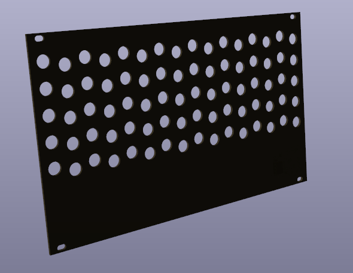
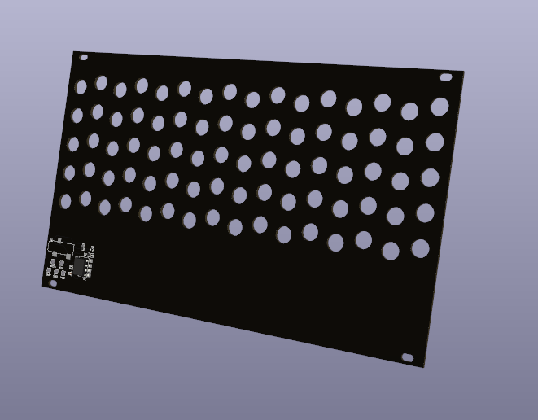

# simple-front-face-midi a PCB front pannel for the simple kit with midi

This git contain a PCB that works as front face for the Simple synth kit by [Synthux academy](synthux.academy/).

The design follow given DXF, available [here](https://tsemah.notion.site/Templates-and-downloads-8c01cea1667d469d839b34c05cf3bd34) for the simple kit with holes for each components and following a eurorack 42 hp design.

On the bottom of the pcb you can find the electronic for to connect midi to your simple synth. The design of the midi interface has been taken from the [simple-midi](https://github.com/Synthux-Academy/simple-midi) board made by Synthux-Academy.

The goal was to have the whole electronic on the bottom with no via so the top stay clean for any custom front pannel design.

# Screenshots

## Top

## Bottom

